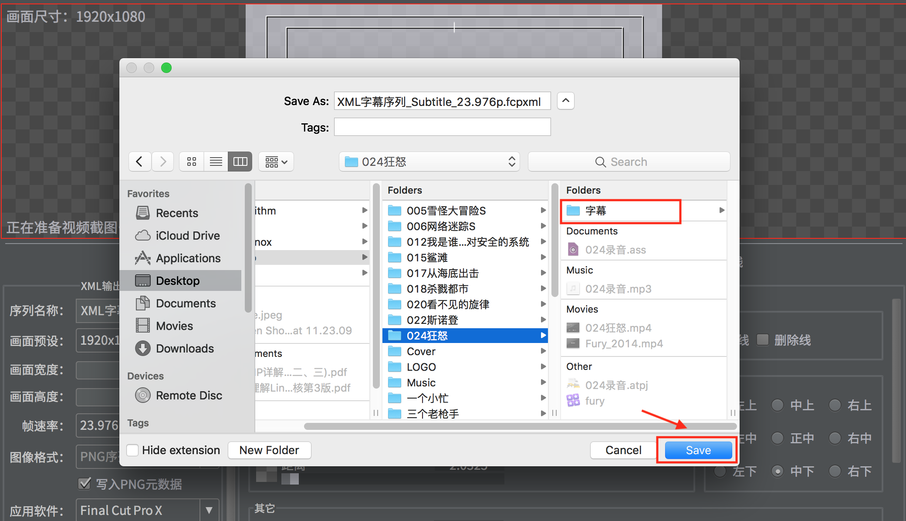
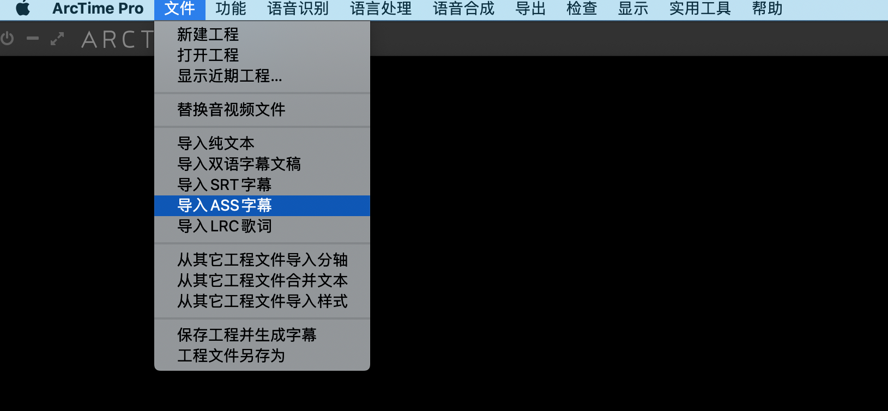
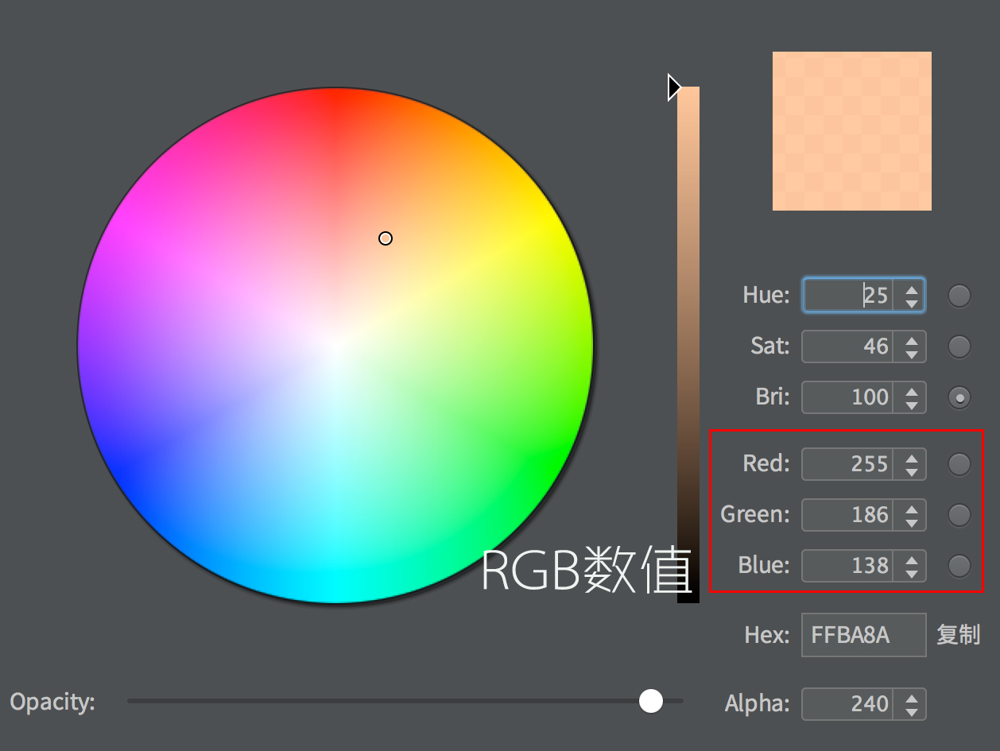

## Final Cut Skills
ArcTime **Pro 4.1**

### [ArcTime Manipulation](#arctime)
- [Export subtitle and XML](#exportsubtitle)
- [Add more subtitle tracks](#moretracks)
- [Change ArcTime Font](#arctimefont)

### ArcTime Manipulation

### Export subtitle and XML

just select `dimension` **1920x1080** and `fps` **23.976**

- select saved path

you'd better make a **Separated Directory** to store all the **PNGs** and **XML**

### Add more subtitle tracks
or compress more subtitles into one.

* Say you already have the `.srt` subtitle, then import it into `Track 1 Group 1`.

* Save the subtitle and you will get an `.ass` subtitle in the current directory with the same name.

* Open the _**newly generated**_ `.ass` subtitle and replace all the **Simplied Chinese** chararters with **Traditional Chinese**.

* Drag the original track to `Track 2` and disable it.

* Import the _**newly generated**_ `.ass` subtitle into `Track 1 Group 2`.

* You have two tracks of subtitles now. Export whichever you like.

### Change Font and Stroke
**Hiragino Sans GB** was the default font, which may be changed to **HYZhengYuan** decorated with **stroke**

Red:**255** Green:**186** Blue:**138**

But I prefer this selection most:

