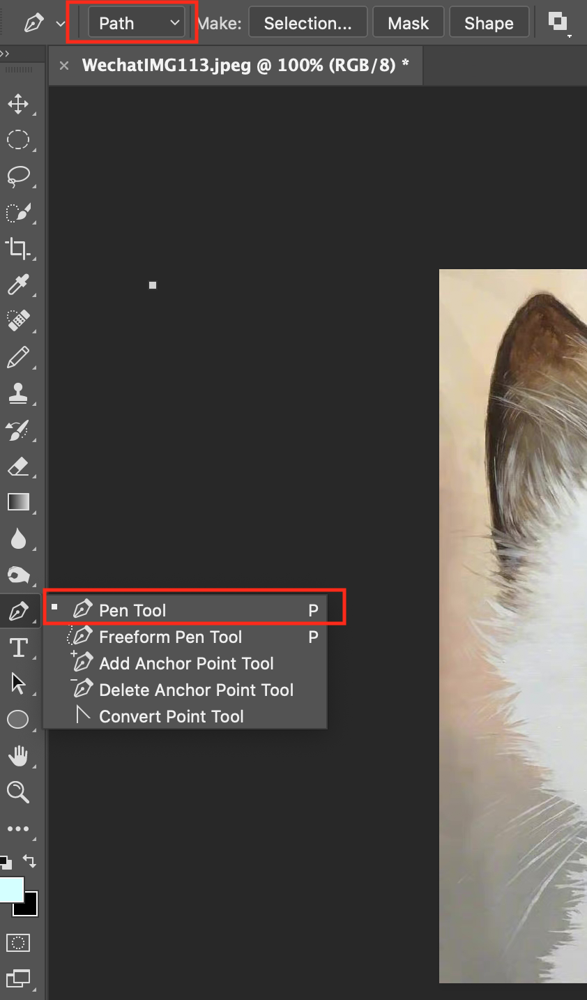
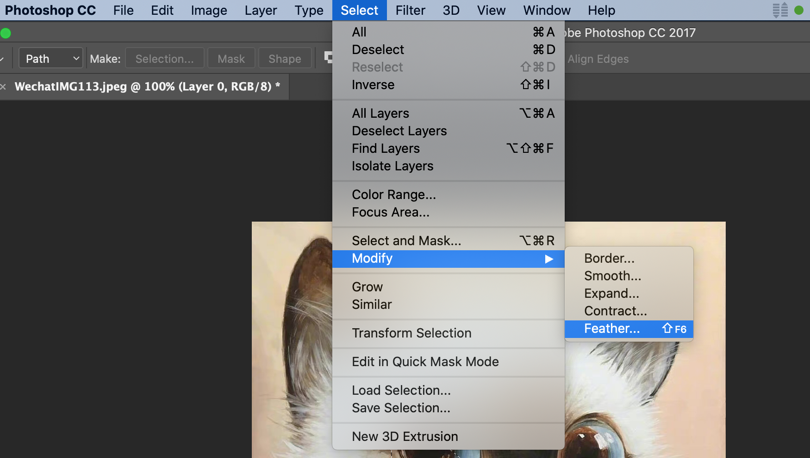

## Final Cut Skills
PhotoShop `2017`

### Photoshop Manipulation
- [Photoshop Manipulation](#photoshop)
    - [How to Add Partial Blur Effect in Photoshop](#pblur)

### Photoshop Manipulation

### How to Add Partial Blur Effect in Photoshop
- Find the **Pen Tool** in the toolbar, as shown in the figure

- Set the drawing type to path

- In the picture, select the part that needs to be processed

- Use the shortcut key `Cmd + Enter` to change the path into a selection

- Then use the shortcut key `Shift + F6` to feather the edge

- Click `Filters` -> `Blur` -> `Gaussian Blur`
