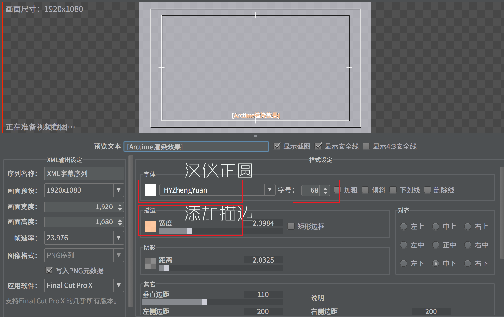
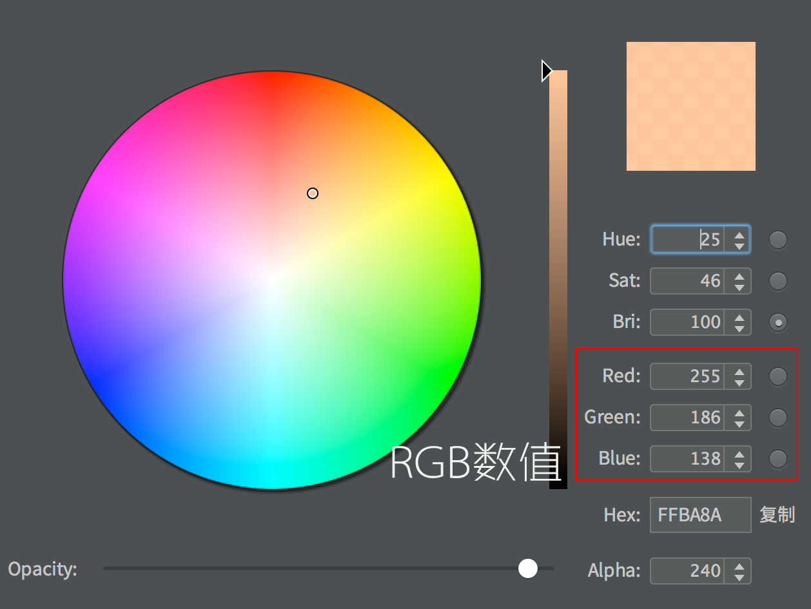
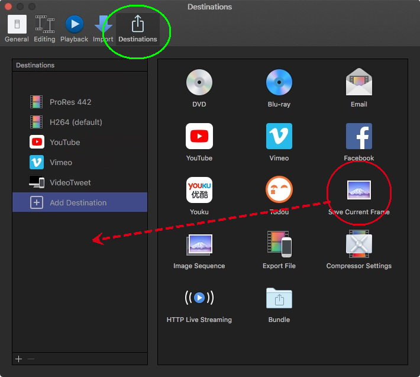
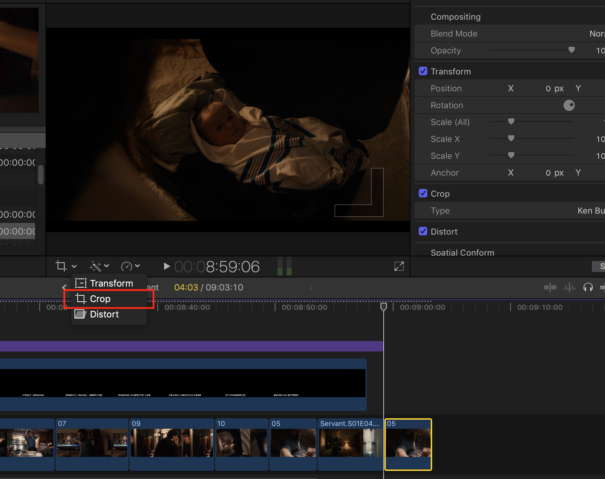
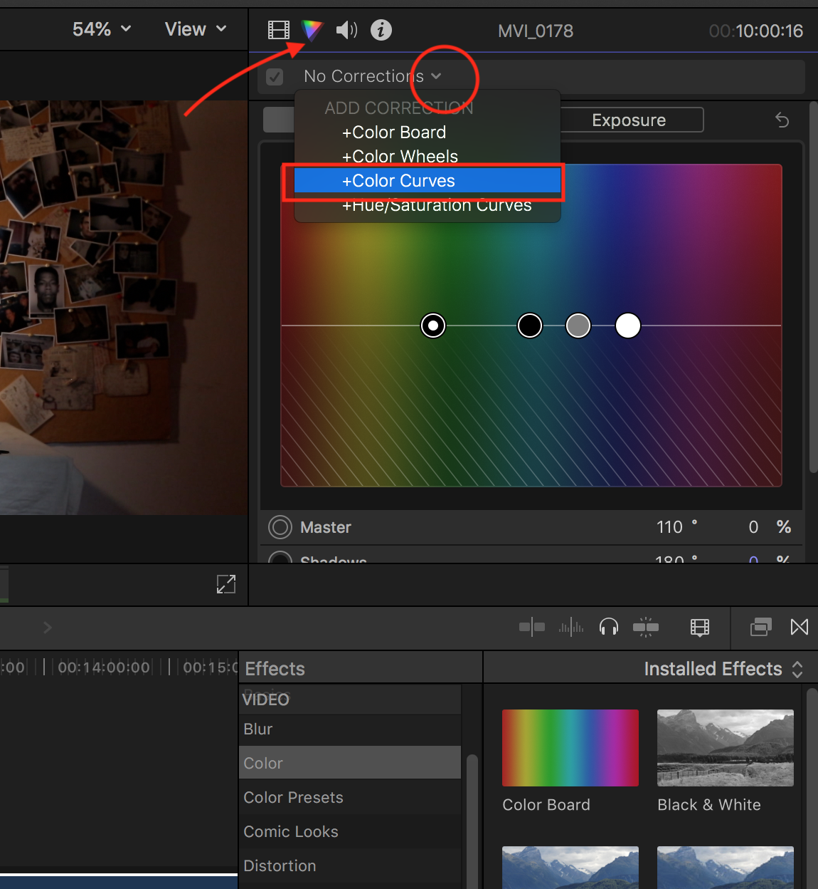
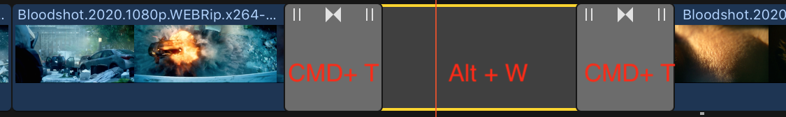

## Final Cut Skills
Final Cut Pro X 10.4.4

### Contents
- [ArcTime Manipulation](#arctime)
    - [Change ArcTime Font](#arctimefont)

- [FCPX Manipulation](#finalcut)
    - [Import Subtitle into FinalCut](#importsubtitle)
    - [How to Save Current Frame](#savecurrentframe)
    - [Apply LetterBox Effect](#applyletterbox)
    - [Logo Addition](#addlogo)
    - [Effect Introduction](#effect)
        - [Gaussian Blur](#gaussian_blur)
        - [Censor](#censor)
        - [Ken Burns](#ken_burns)
        - [How to change Light in FinalCut](#howto_change_light)
    - [Transition Introduction](#transition)
        - [Fade to Black and hold for some time](#fade2black)
    - [Open Library file with older version of FCPX](#exportxml)
    
<a id=arctime></a>
### ArcTime Manipulation
- export subtitle and XML

just select `dimension` **1920x1080** and `fps` **23.976**

<div align=left></div>

- select saved path

you'd better make a **Separated Directory** to store all the **PNGs** and **XML**

<div align=left></div>

<a id=arctimefont></a>
#### Change Font and Stroke
**Hiragino Sans GB** was the default font, which may be changed to **HYZhengYuan** decorated with **stroke**

<div align=left></div>

Red:**255** Green:**186** Blue:**138**

<div align=left></div>

<a id=finalcut></a>
### FinalCut Manipulation

<a id=importsubtitle></a>
#### Import Subtitle into FinalCut
- import xml

only import the **XML**, and it will load the **PNGs** automatically

ignore all warnings

<div align=left></div>

- open title safe zone

<div align=center></div>

- adjust position and scale

select only **one** `PNG`

scale its size to **85%** and put its `Y` position to **-115px**

or `PNG` **90%** and `Y` position **-110px**

<div align=center></div>

- paste attribute to other `PNGs`

`CMD-C` the selected `PNG` and `CMD-A` all of them

<div align=left></div>

- create new compound clip

<div align=left></div>

- go back in `Timeline`

<div align=left></div>

- drag the created **compound subtitle** to `Timeline`

<div align=left></div>

<a id=savecurrentframe></a>
#### Save Current Frame
<div align=left></div>

<a id=applyletterbox></a>
#### Apply LetterBox Effect
- launch effect

`CMD-C` one `Clip` and search `Letterbox` effect

**Double Click** `Letterbox`

<div align=left></div>

- adjust parameter

change `Aspect Ratio` from default **1.85:1** to **2.35:1**

<div align=center></div>

- paste effect to other `Clips`

`CMD-C` the selected `Clip` and `CMD-A` all of them

<div align=center></div>

<a id=addlogo></a>
#### Logo Addition
scale `logo` size to **23%** and drag it to the right position

<div align=center></div>

<a id=effect></a>
#### Effect Introduction
<a id=gaussian_blur></a>
##### Gaussian Blur
- Add Shape

<div align=center></div>

change the shape as you wish

If you want to edit it again after first action, sigle click below **rectangle marked with red**.

<div align=center></div>

<a id=censor></a>
##### Censor
Do You know Mosaic?

<a id=ken_burns></a>
##### Ken Burns
The Ken Burns effect is a type of panning and zooming effect used in video production from still imagery.

- select the pic and choose crop

<div align=center></div>

- choose `Ken Burns Effect`

<div align=center></div>

<a id=howto_change_light></a>
##### [How to change Light in FinalCut](https://zhuanlan.zhihu.com/p/33979553)

Two methods to triger:

- `Triangle` in the `Inspector`(**Recommended**)

<div align=center></div>

- Effects-> Colrs -> Color Curves

<a id=transition></a>
#### Transition Introduction
##### Cross Dissolve
Shortcut Key: `CMD-T`

<a id=fade2black></a>
##### Fade to Black and hold for some time
Add a `Gap`(short cut is Alt + W) between two adjacent clips and typed `Cmd + T` adding Cross Dissolve Transition

<div align=center></div>

##### Fade to Color
- Search "fade to"
- Can be changed to **other colors**

##### Blurs
Blurs-> Simple

<a id=exportxml></a>
#### Open Library file with older version of FCPX

```
File -> Export XML -> XML version
```

choose Previous Version, and then click Save.

Open the saved file on older version of FCPX, and the relink the missing parts. Enjoy!!