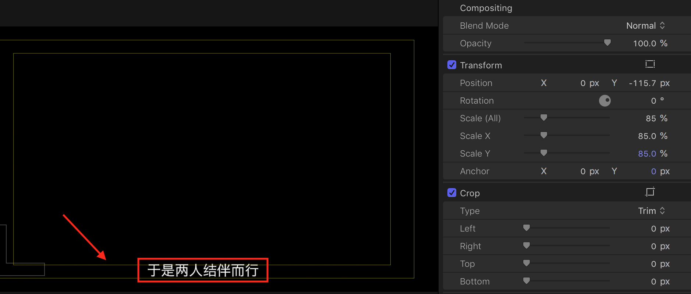

### Skills about Film Clip
### Final Cut
- positioin tools

### Add Subtitle Efficiently
#### export from Arctime

#### import to final cut
Effect -> LetterBox

scale font png to `85%`

#### open title safe zone

### Add logo
scale logo size to `21%` and drag it to right position

### Transition
- `fade to color`
- `cross dissolve` (Ctrl - T)
- `censor` Mosaic