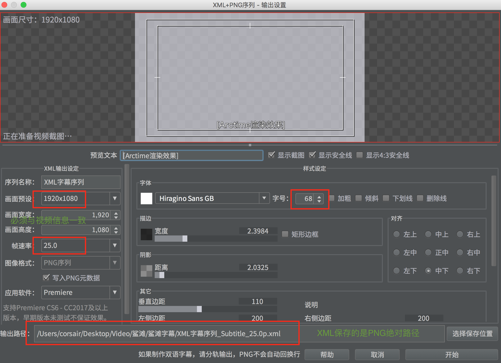
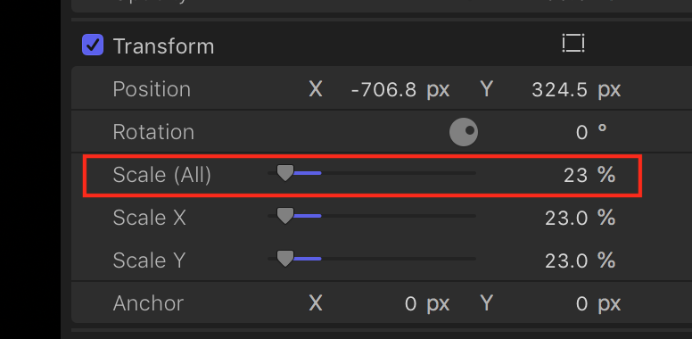

### Skills about Film Clip
### Final Cut
- positioin tools

### Add Subtitle Efficiently
#### export from Arctime

#### import to final cut
scale font png to `90%` and put its y position to `-110`

### Add logo
scale logo size to `23%` and drag it to right position

