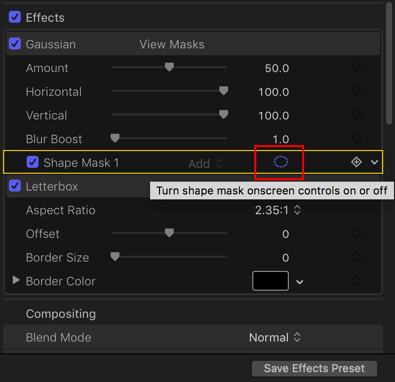

## Final Cut Skills
finalcut pro X 10.4.4

### Contents
- [ArcTime Manipulation](#arctime)
- [Import Subtitle into FinalCut](#importsubtitle)
- [Apply LetterBox Effect](#applyletterbox)
- [Logo Addition](#addlogo)
- [Effect Introduction](#effect)
- [Transition Introduction](#transition)

### ArcTime Manipulation
- export subtitle and XML

just select `dimension` **1920x1080** and `fps` **23.976**

- select saved path

you'd better make a **Separated Directory** to store all the **PNGs** and **XML**

### Import Subtitle into FinalCut
- import xml

only import the **XML**, and it will load the **PNGs** automatically

ignore all warnings

- open title safe zone

- adjust position and scale

select only **one** `PNG`

scale its size to **85%** and put its `Y` position to **-115px**

or `PNG` **90%** and `Y` position **-110px**

- paste attribute to other `PNGs`

`CMD-C` the selected `PNG` and `CMD-A` all of them

- create new compound clip

- go back in `Timeline`

- drag the created **compound subtitle** to `Timeline`

### Apply LetterBox Effect
- launch effect

`CMD-C` one `Clip` and search `Letterbox` effect

**Double Click** `Letterbox`

- adjust parameter

change `Aspect Ratio` from default **1.85:1** to **2.35:1**

- paste effect to other `Clips`

`CMD-C` the selected `Clip` and `CMD-A` all of them

### Logo Addition
scale `logo` size to **23%** and drag it to the right position

### Effect Introduction
#### Gaussian
- Add Shape

change the shape as you wish

If you want to edit it again after first action, sigle click below **rectangle marked with red**.

#### Censor
used for Mosaic

### Transition Introduction
#### Cross Dissolve

shortcut key: `CMD-T`
 
#### Fade to Color

The black field transition